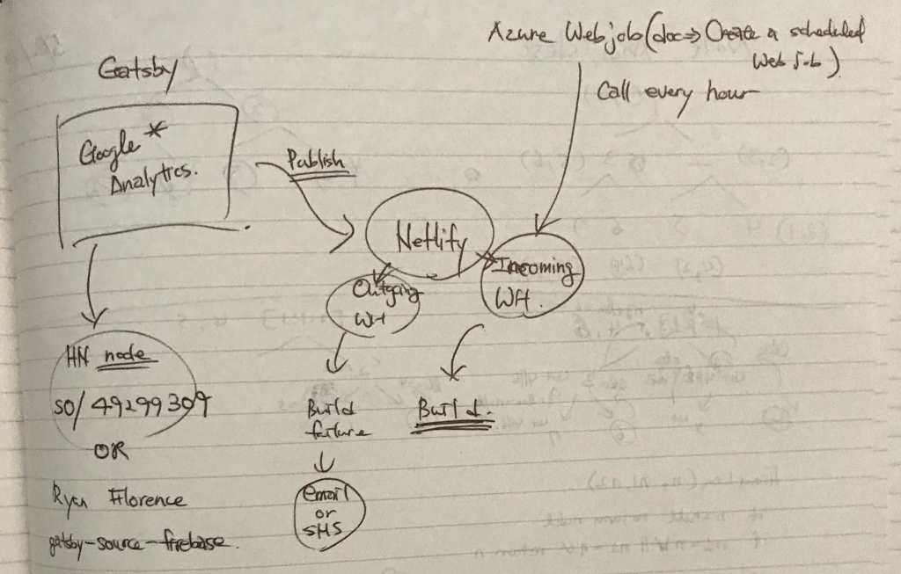

## 🚀 SHaNc - Static Hacker News clone

### ❓ Why?

Because I want to skim through stories and be done with it.  
I don't need up-to-date stories.

### ⏲ How often does it refresh?

Every hour on the hour.

### ⚠️Note

Currently it only shows Top stories.  
I will add "new" and "best" stories later on.

### 🔨 Technologies (and stuff...)

* Static Site Generator: [Gatsby](https://www.gatsbyjs.org/)
* [Styled Components](https://www.styled-components.com/)
* Custom Hacker News GraphQL [source](https://github.com/dance2die/SHANc/blob/master/gatsby-node.js)
  * Simply calls Official [HN API](https://github.com/HackerNews/API).
* Server: [Netlify](https://www.netlify.com/)
* Build Trigger: [Azure Functions](https://docs.microsoft.com/en-us/azure/azure-functions/) (PowerShell)
  * Netlify exposes Build WebHook. Azure Functions written in PowerShell simply calls it with `Invoke-WebRequest` every hour
* [GitHub Corners](https://github.com/tholman/github-corners) by [Tim Holman](http://tholman.com/)

### 📐 Architecture

The awesome hand-drawn architecture

